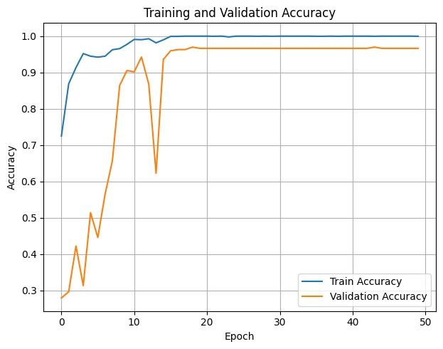
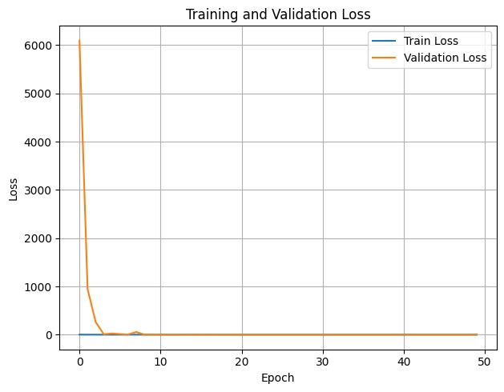

# Brain Tumor Detection using Deep Learning

This project presents a Convolutional Neural Network (CNN) model to classify MRI images of brain tumors into glioma, meningioma, and pituitary categories. 
Built using TensorFlow and Keras, it achieves **99.5% accuracy** and uses Transfer Learning (YOLOv7) and OpenCV for image preprocessing.

## 🔬 Dataset
- Source: Public dataset from **Figshare**
- MRI images labeled into 3 types: **Glioma**, **Meningioma**, **Pituitary**

## ⚙️ Technologies Used
- Python
- TensorFlow / Keras
- OpenCV
- SQLite
- Jupyter Notebook

## 📊 Results
  

## 💻 How it Works
The system takes MRI images via a simple interface, processes them with a trained CNN model, and classifies the tumor. Results are shown to the user and recorded in a SQLite database.

## 📁 Project Structure
- `main_model.ipynb` - CNN training and prediction code
- `dataset_sample/` - Few sample MRI images (for demo)
- `results/` - Accuracy/loss charts
- `documentation.pdf` - Project summary

## 🔗 Code

[View Code Here](main_model.ipynb)

## 📬 Contact
Smavia Neelam  
📧 neelamsmavia@gmail.com
